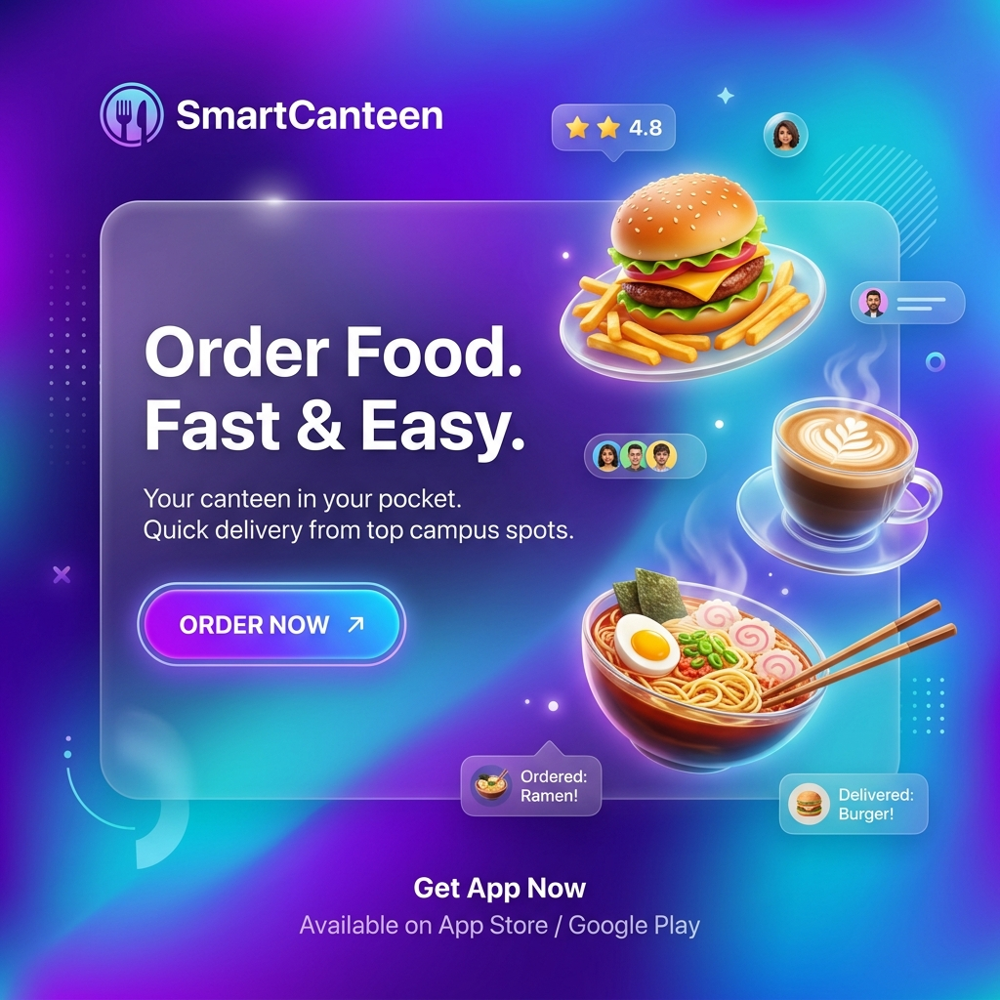

# 🍽️ SmartCanteen: The Future of Campus Dining

> **"Experience glassmorphism meets gastronomy."**
> A premium, end-to-end Student Canteen Pre-Order & Management System designed for the modern campus.

---

## ✨ The Vision
SmartCanteen isn't just a menu—it's a comprehensive digital ecosystem. By merging **high-end glassmorphism design** with robust real-time tracking, we've transformed the traditional canteen rush into a seamless, luxury dining experience.

---

## 🚀 Experience The Magic

### 🎓 Student Portal | *Dining Reimagined*
*   **Intuitive Discovery**: Search and filter through today's delicacies with a high-performance search engine and category pills.
*   **Fluid Logic**: Add items to your cart with zero-latency updates and elegant "pop" animations.
*   **Dynamic Wallet**: A boutique digital card experience for instant top-ups and secure payments.
*   **Real-time Seating**: Visualize the cafe's capacity before you even step through the door.
*   **Order Tracking**: Live status updates across 4 preparation stages, ensuring you never miss a beat.

### 👨‍🍳 Staff Portal | *Kitchen Efficiency*
*   **Traffic Management**: A powerful grid layout to monitor and transition incoming orders with ease.
*   **Inventory Control**: Toggle dish availability instantly to reflect real-world stock levels.
*   **Occupancy Control**: Manage seat availability manually to synchronize the portal with the physical floor.

### 🛡️ Admin Portal | *Data-Driven Intelligence*
*   **Branding Control**: Instantly customize the Canteen name and tagline globally.
*   **Analytics Engine**: Stunning donut and bar charts (powered by Chart.js) visualizing revenue trends and popular items.
*   **Menu Architect**: Effortlessly add new culinary creations with a streamlined modal interface.

---

## 🎨 Design Philosophy

### **Glassmorphism 2.0**
Enjoy a stunning translucent UI that breathes life into the screen. We utilize saturated mesh backgrounds and animated orbs to create depth and focus.

### **Fluid Motion**
*   **Staggered Entrance**: Card grids that flow in sequentially.
*   **3D Perspective**: Hover effects that tilt menu cards in 3D space.
*   **Tactile Feedback**: Cart "bump" animations and confetti celebrations upon successful orders.

### **Dark Mode Mastery**
A meticulously curated palette of deep slates and electric purples, optimized for high precision and eye comfort during late-night study sessions.

---

## 🛠️ Technical Artistry

*   **Frontend**: Vanilla HTML5, CSS3 (Modern Flexbox/Grid), ES6+ JavaScript.
*   **Visuals**: [Chart.js](https://www.chartjs.org/) for analytics & [FontAwesome](https://fontawesome.com/) for iconography.
*   **Animations**: Custom CSS Keyframes & Cubic-Bezier transitions.
*   **Responsiveness**: Mobile-first architecture that scales beautifully across all devices.

---

## 📂 Project Anatomy

- `index.html` — The centralized UI orchestrator.
- `styles.css` — The design system: variables, glassmorphism, and motion.
- `app.js` — The logic core: state management, real-time filters, and payment simulation.

---
*Created with ♥ to make every meal a highlight of the campus day.*
